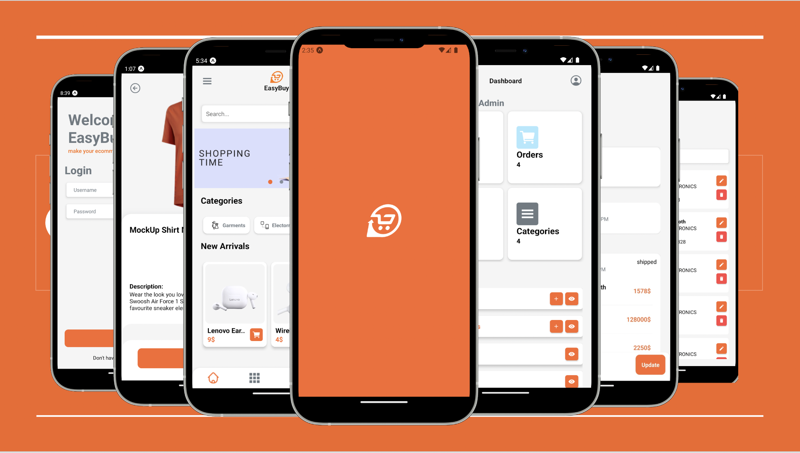

### EasyBuy | Ecommerce Cross Platfrom (React Native) App

> 
> Ecommerce is buying and selling that is conducted in an online environment, through an ecommerce application. An application is a software program designed to accomplish one or more tasks in a particular software environment. An ecommerce application is a software application that is specifically designed to support the creation of an ecommerce application or add functionality to it. Plug-ins and add-ons to ecommerce application software are included, but applications that don’t have specific ecommerce utility wouldn’t be considered. What is integral to one ecommerce app may not be needed at all for another. 'EasyBuy' come app with a complete solve to Ecommerce problems
>
> `Ecommrce` `Cross Platform` `React Native` `Node` <br> [](https://github.com/bukhtyarhaider/EasyBuy-Ecommerce_App/releases/download/app/EasyBuy-V1_9.apk)

[](https://github.com/UsamaSarwar/reactnative-ecommerce-charlie)

## `Development Stack` ➡️ []()

### `Backend on NodeJs` ➡️ [https://github.com/abidrazaa/backend-node](https://github.com/abidrazaa/backend-node)

Open-Source React Native Ecommerce Cross Platform Mobile App :iphone:

## Features :memo:

- [x] Stack Naviagtion
- [x] Splash Screen
- [x] Login Screen
- [x] Signup Screen
- [x] Forget Screen
- [x] User Profile Screen
- [x] My Account Screen
- [x] Update Password Screen
- [x] Admin Login
- [x] Admin Dashboard
- [x] Admin Add Product
- [x] Admin View Product
- [x] Admin Edit Product
- [x] Cart Screen
- [x] Checkout Screen

## How to Run App :white_check_mark:

### `Clone the repo`

To clone this repo, type the following command

```
git clone https://github.com/UsamaSarwar/reactnative-ecommerce-charlie.git
```

### `Node Package Manager`

To install all the dependencies, use node package manager and run the command

```
npm i
```

### `npm start`

Runs your app in development mode.

Open it in the [Expo app](https://expo.io) on your phone to view it. It will reload if you save edits to your files, and you will see build errors and logs in the terminal.

Sometimes you may need to reset or clear the React Native packager's cache. To do so, you can pass the `--reset-cache` flag to the start script:

```
npm start -- --reset-cache
# or
yarn start -- --reset-cache
```

# v22.07.28

The demonstration of Signup flow and the flow of login from normal user and admin can be seen from [here](https://drive.google.com/drive/folders/1jnFENm2_fdwvpfrqEZxrqx9pOThvSMa3)

The demonstration of the app can be seen from [here](https://drive.google.com/drive/folders/1PNyGSzUDNxUtrmtVk9bp8Lp82INrSct-)

## Thanks to all the contributors ❤️

<a href = "https://github.com/UsamaSarwar/reactnative-ecommerce-charlie">
  
</a>
